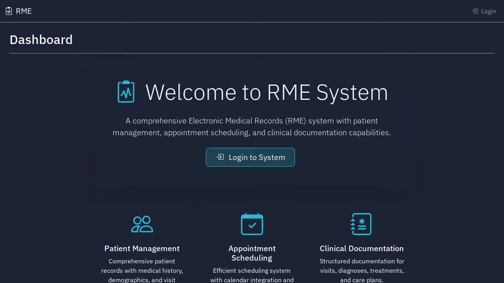
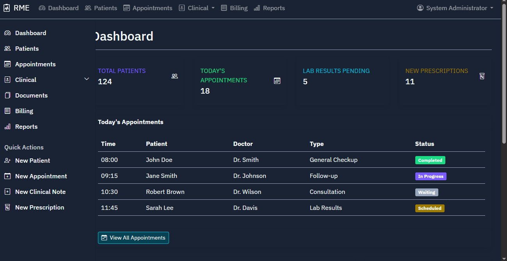

# Electronic Medical Records (RME) System

A comprehensive Electronic Medical Records (RME) system that allows healthcare providers to manage patient information, appointments, prescriptions, clinical notes, lab results, and more.




## Features

- **User Management**: Role-based access control with different user roles (admin, doctor, nurse, receptionist, lab technician, billing staff)
- **Patient Management**: Store and manage complete patient records with medical history
- **Appointment Scheduling**: Schedule, manage and track patient appointments
- **Clinical Documentation**: Record clinical notes, diagnoses, and treatment plans
- **Prescription Management**: Create and manage prescriptions with medication details
- **Laboratory Integration**: Record and view lab test results
- **Billing & Invoicing**: Create and manage patient invoices
- **Document Management**: Upload and store patient-related documents
- **Reporting & Dashboard**: View statistics and reports on various metrics

## Technology Stack

- **Backend**: Python with Flask web framework
- **Database**: PostgreSQL for reliable data storage
- **ORM**: SQLAlchemy for database interactions
- **Frontend**: Bootstrap 5 for responsive design
- **Authentication**: Flask-Login for secure user authentication
- **Forms**: Flask-WTF for form handling and validation

## Installation

1. Clone the repository
```
git clone <repository-url>
cd electronic-medical-records
```

2. Set up a virtual environment
```
python -m venv venv
source venv/bin/activate  # On Windows, use: venv\Scripts\activate
```

3. Install dependencies
```
pip install -r requirements.txt
```

4. Set environment variables
```
export DATABASE_URL="your-database-url"
export SESSION_SECRET="your-secret-key"
```

5. Run database migrations
```
python seed_database.py
```

6. Start the application
```
python main.py
```

## Default Users

The system comes with pre-configured users for testing:

| Username     | Password     | Role         |
|--------------|--------------|--------------|
| admin        | admin1234    | Administrator|
| doctor       | doctor1234   | Doctor       |
| nurse        | nurse1234    | Nurse        |
| receptionist | reception1234| Receptionist |
| labtech      | labtech1234  | Lab Tech     |
| billing      | billing1234  | Billing Staff|

## Project Structure

- `/app.py` - Main application configuration
- `/models.py` - Database models
- `/forms.py` - Form definitions
- `/routes/` - Route modules for different functionalities
- `/templates/` - HTML templates organized by feature
- `/static/` - Static files (CSS, JavaScript, images)

## License

This project is licensed under the MIT License - see the LICENSE file for details.

## Contributors

- Your Name - Initial work